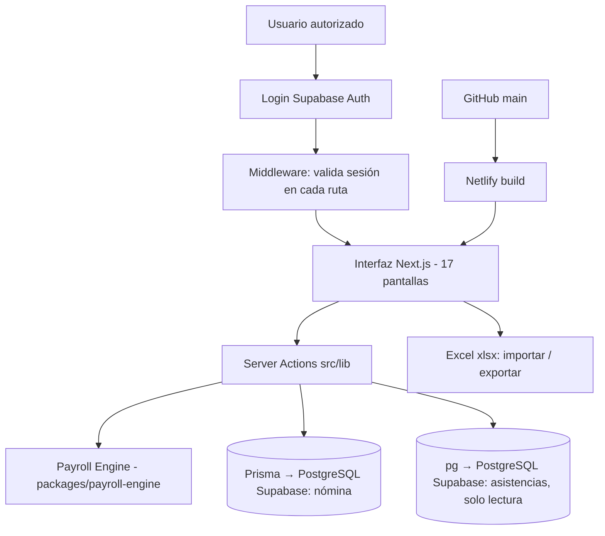

# 1. Resumen ejecutivo

**Nombre:** Costo Real de Nómina.
**Objetivo:** calcular, a partir del **sueldo neto pactado** con cada trabajador, la nómina completa de Seanjuan/Blue Desert Cabo: la parte **fiscal** (ISR, IMSS, subsidio), la parte de **asimilables a salarios** (cálculo inverso: del neto deseado al bruto), y el **costo patronal real** (IMSS patrón, INFONAVIT, SAR, ISN, provisiones de aguinaldo y prima vacacional, comisión de dispersión de asimilables).

**Problema que resuelve:** la empresa pacta sueldos en neto y paga con un esquema mixto (nómina fiscal + honorarios asimilados). Antes, conocer el costo total por trabajador/periodo, conciliar contra la nómina timbrada y proyectar presupuesto requería hojas de Excel manuales. La app centraliza parámetros fiscales versionados, días de asistencia reales, incidencias (vacaciones, domingos, festivos), descuentos (Infonavit, Fonacot, préstamos, pensiones), pagos extraordinarios, y produce reportes conciliables al centavo.

**Usuarios:** Dirección de Finanzas y personal autorizado (alta manual en Supabase Auth; sin registro público).

**Funciones principales:** cálculo de nómina quincenal/mensual · preparación de días desde la BD de asistencias · captura de incidencias y pagos extra · ajuste con layout oficial de ISR/IMSS · importación de nóminas históricas · reportes (consolidado, fiscal, asimilables, por trabajador, acumulado, mensual por departamento, SDI) · presupuesto y semáforo · simulador de incrementos · editor versionado de parámetros fiscales.

**Módulos (menú):** Dashboard · Nómina · Empleados (+Importar) · Centros de costos · Asistencias · Historial (+Importar histórica, detalle por periodo y por trabajador) · Reporte mensual · SDI · Presupuesto · Configuración fiscal (+Editor) · Simulador · Login.

**Tecnologías:** Next.js 15 (App Router, Server Actions, React 19, TypeScript estricto), Prisma 5.22 (PostgreSQL), Supabase (base de datos + Auth), `pg` (conexión directa de solo lectura a la BD de asistencias), SheetJS `xlsx` (importar/exportar Excel), Tailwind (clases utilitarias en `globals.css`), Vitest (21 pruebas del motor).

**Base de datos:** PostgreSQL en Supabase (proyecto `ailaimolpfeuwsaywohr`); conexión de la app vía *transaction pooler* (puerto 6543, `pgbouncer=true`); migraciones vía `DIRECT_URL` (5432).

**Autenticación:** Supabase Auth por correo/contraseña; `src/middleware.ts` protege todas las rutas.

**Despliegue:** Netlify (sitio `costonomina`, https://costonomina.netlify.app), build automático en cada push a `main` de GitHub (`tomasbluedesert/nomina`).

## Diagrama general

El **Payroll Engine** es un paquete puro (sin dependencias de Next ni de BD): recibe trabajador + periodo + parámetros y devuelve el resultado completo. Toda la lógica de cálculo vive ahí y está cubierta por pruebas.
