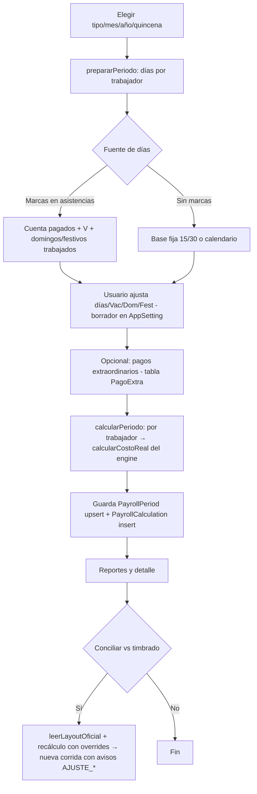

# 4. Flujos operativos y matriz de procesos

## P1 — Cálculo de nómina del periodo (núcleo)
Objetivo: nómina completa + costo real del periodo. Responsable: Finanzas. Inicio: /nomina.

Validaciones: parámetros vigentes a la fecha fin (`paramsVigentes` lanza error si no hay); `validar()` del engine (SD < salario mínimo → warning; tabla ISR vencida → warning). Excepciones por trabajador se reportan sin frenar al resto. Tablas: PayrollPeriod, PayrollCalculation, PagoExtra, AppSetting. Automático: subida de asistencias, cálculo de primas/exenciones, inverso de asimilables, provisiones, ISN, comisión.

## P2 — Preparación de días (subproceso de P1)
`src/lib/dias.ts::diasDelPeriodo`: lee marcas del periodo (`asistencia.dias` JSONB), aplica `codigosCfg` (paga/trabaja) y `reglaSinMarca`; bajas (incidencias) cortan al último día; festivos de la tabla `festivos` o marca DF; domingos por fecha (UTC día 0) con marca "trabaja".

## P3 — Alta/edición de trabajador
/empleados → `guardarEmpleado` (upsert por id; crea puesto en catálogo si es nuevo). Entrada: expediente completo. Resultado: Employee. Excepción: número o RFC duplicados (únicos por empresa) → error de Prisma.

## P4 — Carga masiva de trabajadores
/empleados/importar → `importarEmpleados`: normaliza encabezados, upsert por `numero_empleado`, crea catálogos que no existan; reporta por fila (creado/actualizado/error).

## P5 — Sincronización con asistencias
/asistencias → `sincronizarCatalogos` y `sincronizarEmpleados` (opciones: soloActivos, sobrescribirSueldos, traerDescuentos, traerSdi). Identidad manda asistencias; sueldos de nómina se conservan salvo casilla.

## P6 — Importación de nómina histórica
/historial/importar → `importarNominaHistorica`: agrupa filas por RFC (fiscal+asimilado), arma un ResultadoTrabajador con importes del archivo (incluye Ajuste al neto), crea PayrollPeriod estado `importado` + PayrollCalculation con warning IMPORTADO. Sin cargas patronales.

## P7 — Gestión de parámetros fiscales
/configuracion-fiscal(/editar) → `guardarVersionParams` (nueva/sobrescribir) y `activarParamSet` (vence las de vigencia traslapada). El JSON completo se hashea (`hashParams`); cada cálculo guarda id+hash → inmutabilidad.

## P8 — Presupuesto y escenarios
/presupuesto → `guardarPresupuesto` (Scenario tipo presupuesto, monto mensual) y líneas de escenario propuesto (incremento/alta/baja) normalizadas a base mensual; el Dashboard consume el último presupuesto.

## P9 — Eliminación de periodo
/historial → `eliminarPeriodo` (server action del page): borra PayrollCalculation del periodo y el PayrollPeriod. Definitivo, sin papelera.

## Matriz de procesos
| Proceso | Módulo | Usuario | Entrada | Acción | Resultado | Base de datos |
|---|---|---|---|---|---|---|
| Login | /login | Todos | correo+contraseña | signInWithPassword | Sesión (cookies) | Supabase Auth |
| Preparar días | /nomina | Finanzas | periodo | Lee asistencias+códigos | Tabla editable + borrador | AppSetting; lectura BD asistencias |
| Pagos extra | /nomina | Finanzas | trabajador, concepto, importe, destino | create/delete | Bonos del periodo | PagoExtra |
| Calcular nómina | /nomina | Finanzas | días+extras | Engine por trabajador | Resultados + guardado | PayrollPeriod, PayrollCalculation |
| Ajuste layout | /nomina | Finanzas | Excel oficial | overrides ISR/IMSS/asim | Nueva corrida + avisos | PayrollCalculation |
| Alta trabajador | /empleados | Finanzas | expediente | upsert | Employee | Employee, Puesto |
| Carga masiva | /empleados/importar | Finanzas | Excel | upsert por número | Reporte por fila | Employee, CostCenter, Puesto |
| Sincronizar | /asistencias | Finanzas | opciones | lectura remota + upsert | Trabajadores/catálogos | Employee, CostCenter, AppSetting |
| Importar histórica | /historial/importar | Finanzas | Excel recibos | cruce por RFC | Periodo importado | PayrollPeriod, PayrollCalculation |
| Eliminar periodo | /historial | Finanzas | periodo | deleteMany+delete | Periodo eliminado | PayrollPeriod, PayrollCalculation |
| Versionar parámetros | /config-fiscal/editar | Finanzas | JSON editado | nueva versión + hash | Versión activable | FiscalParamSet |
| Presupuesto | /presupuesto | Finanzas | monto mensual / líneas | create | Semáforo en Dashboard | Scenario, ScenarioLine |
| Reportes | /historial/[id], /reporte-mensual, /sdi | Finanzas | periodo/fecha | agregación + Excel | Tablas y archivos | lectura PayrollCalculation |
| Simular incremento | /simulador | Finanzas | neto nuevo | simularIncremento | Costo marginal | lectura |
