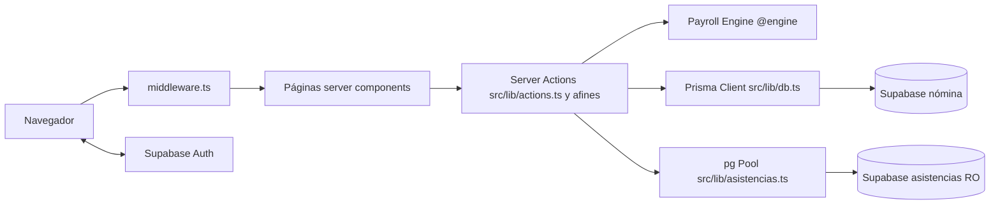

# 5. Arquitectura técnica y estructura del proyecto

| Capa | Tecnología |
|---|---|
| Frontend | Next.js 15 App Router, React 19, TypeScript estricto, Tailwind (clases en `globals.css`) |
| Backend | Server Actions (`'use server'` en `src/lib/*.ts` y actions inline) — no hay carpeta `api/` con endpoints REST propios |
| Motor de cálculo | `packages/payroll-engine` (TypeScript puro, sin dependencias; alias `@engine`) |
| ORM | Prisma 5.22 (`binaryTargets: native + rhel-openssl-3.0.x`) |
| BD principal | PostgreSQL (Supabase, proyecto nómina) vía transaction pooler 6543 `pgbouncer=true&connection_limit=1` |
| BD secundaria | PostgreSQL (Supabase, proyecto asistencias) vía `pg` Pool, usuario solo-lectura `nomina_lector` |
| Autenticación | Supabase Auth (@supabase/ssr) + `src/middleware.ts` |
| Excel | SheetJS `xlsx` (cliente para exportar; servidor para importar) |
| Hosting | Netlify + `@netlify/plugin-nextjs` (`netlify.toml`) |
| Pruebas | Vitest — `packages/payroll-engine/test/engine.spec.ts` (21 casos) |



## Estructura del proyecto
```text
nomina/
├── netlify.toml            # build + plugin Next para Netlify
├── .env / .env.example     # 5 variables (ver doc 11); .env NUNCA se versiona (.gitignore)
├── prisma/
│   ├── schema.prisma       # 11 modelos + enums (fuente única del esquema)
│   ├── migrations/         # historial de migraciones (aplicar con prisma migrate dev)
│   └── seed.ts             # siembra empresa + parámetros iniciales (params-2026.json)
├── packages/payroll-engine/
│   ├── src/index.ts        # TODA la lógica de cálculo (ver doc 08)
│   ├── src/types.ts        # contratos: EmpleadoInput, FiscalParamSet, ResultadoTrabajador…
│   ├── seed/params-2026.json  # parámetros base 2026 (UMA, tarifas, IMSS, LFT, ISN…)
│   └── test/engine.spec.ts # pruebas de regresión (incluye casos conciliados con nómina real)
└── src/
    ├── middleware.ts       # protección global de rutas
    ├── app/                # una carpeta por pantalla (page.tsx server + ui.tsx client)
    ├── components/         # ReportesNomina, ResultadoTrabajador, CodigosAsistencia, EsquemaFields
    └── lib/                # server actions y utilidades:
        ├── actions.ts          # núcleo: empleados, periodos, cálculo, pagos extra, params, layout
        ├── db.ts               # singleton PrismaClient
        ├── supabase.ts         # cliente SSR + currentUserEmail
        ├── asistencias.ts      # consultas SQL a la BD de asistencias
        ├── dias.ts             # días pagados/vacaciones/domingos/festivos por trabajador
        ├── sync.ts             # sincronización de catálogos y trabajadores
        ├── import.ts           # carga masiva de trabajadores (Excel)
        ├── import-historico.ts # importador de nóminas pagadas
        ├── params.ts           # paramsVigentes + hashParams (SHA-256)
        └── format.ts           # num(), rangoPeriodo()
```
Dependencias entre capas: las páginas solo llaman a `src/lib`; `src/lib` es lo único que toca BD; el engine no conoce BD ni Next (regla a conservar — ver doc 12).
