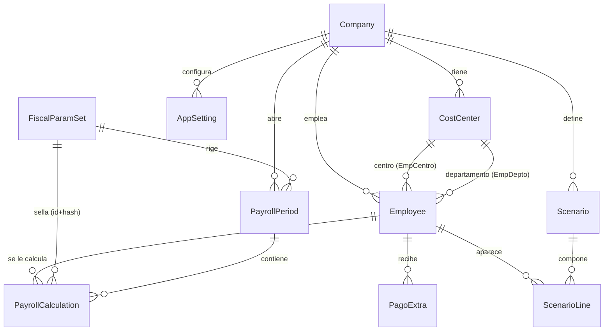

# 6. Base de datos (Prisma / PostgreSQL Supabase)

11 modelos. Multi-empresa por diseño (todo cuelga de Company; hoy hay una sola: Seanjuan).

| Modelo | Propósito | Claves/restricciones | Usado por |
|---|---|---|---|
| Company | Empresa (razón social, RFC único, prima de riesgo, estado ISN) | PK uuid; rfc @unique | Todo |
| CostCenter | Catálogo unificado: `tipo` = departamento \| propiedad \| centro_costos | @@unique(companyId,nombre); doble relación con Employee | Empleados, reportes, sync |
| Employee | Expediente: sueldos, esquema, periodicidad, tipoCálculo, sdiRegistrado, 4 descuentos fijos, asistenciasId | @@unique(companyId,numeroEmpleado) y (companyId,rfc) | Nómina, reportes, sync, importadores |
| Puesto | Catálogo simple de puestos | — | Empleados |
| FiscalParamSet | Parámetros fiscales versionados: `data` Json completo + `hashSha256`; vigencias y estado (borrador/vigente/vencido) | @@unique(ejercicio,version) | Cálculo, editor, SDI, presupuesto, simulador |
| PayrollPeriod | Periodo (quincenal/mensual) con paramSetId y estado (abierto/importado) | @@unique(companyId,fechaInicio,fechaFin) | Nómina, historial, dashboard |
| PayrollCalculation | **Solo INSERT** (auditoría inmutable): inputSnapshot, result (ResultadoTrabajador completo), warnings, paramSetHash, calculatedBy | índices (employeeId,calculatedAt) y (periodId) | Todos los reportes |
| PagoExtra | Bonos por trabajador y periodo, destino fiscal/asimilables | índice (companyId,fechaInicio,fechaFin); onDelete Cascade con Employee | Nómina |
| Scenario / ScenarioLine | Presupuesto mensual objetivo y escenario propuesto (incremento/alta/baja) | Line onDelete Cascade | Presupuesto, dashboard |
| AppSetting | Clave-valor por empresa: `codigosCfg`, `reglaSinMarca`, borradores de días (`borrador_dias:<ini>:<fin>`), umbrales de semáforo | — | Nómina, asistencias, dashboard |

Historia/auditoría: recalcular un periodo **no** actualiza filas — inserta nuevas PayrollCalculation; las vistas toman la más reciente por trabajador (`distinct: ['employeeId']`, orden desc). El JSON `result` es autosuficiente: los reportes no recalculan nada.

Convenciones: montos `Decimal(12,2)` (presupuesto 14,2; prima de riesgo 7,5); fechas de negocio `@db.Date`; ids uuid.
