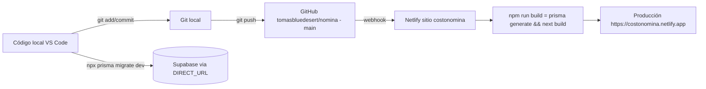

# 11. Despliegue

- **Rama:** `main` (única). **Build:** `npm run build` (netlify.toml) = `prisma generate && next build`; el chequeo estricto de tipos corre en el build (un error de tipos tumba el deploy).
- **Variables en Netlify** (Site configuration → Environment variables): las 5 del `.env`; `DATABASE_URL` DEBE ser la del pooler transaccional `:6543/postgres?pgbouncer=true&connection_limit=1`.
- **Migraciones:** NO corren en Netlify. Se aplican desde la máquina local: `npx prisma migrate dev --name <nombre>` (usa `DIRECT_URL`, puerto 5432). Orden ante un parche con migración: aplicar migración → push del código.
- **Prisma en serverless:** `binaryTargets = ["native", "rhel-openssl-3.0.x"]` en schema.prisma (obligatorio para las funciones de Netlify).
- **Rollback:** Netlify → Deploys → seleccionar un deploy anterior en verde → **Publish deploy** (instantáneo). No revierte migraciones de BD: para cambios de esquema, planear compatibilidad hacia atrás.
- **Local:** `npm run dev` en `C:\Users\Blue Desert Cabo\nomina` → http://localhost:3000 (misma BD de producción: no hay entorno de pruebas separado — ver deuda técnica).
- **Pruebas del motor:** `npm test` (Vitest) — correr antes de tocar el engine.
